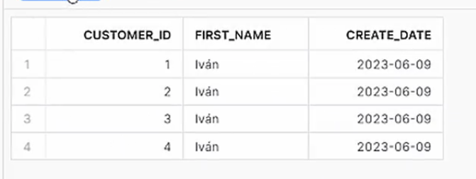
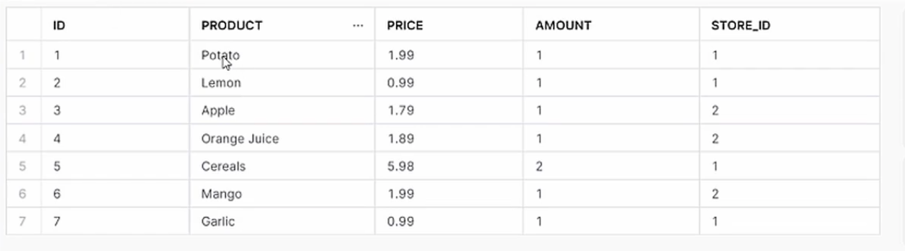
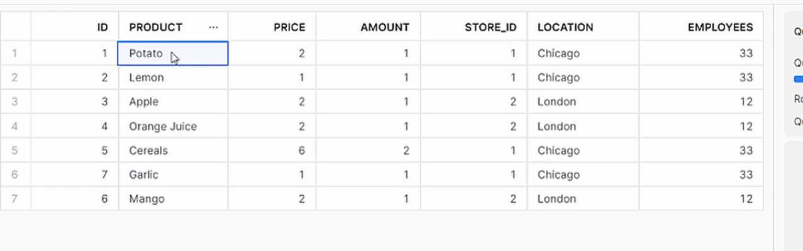

# 7-Creación-de-tareas-y-streams
1. [¿Qué son las tareas en Snowflake?](#schema1)
2. [Uso de CRON para crear tareas con periodicidad flexible](#schema2)
3. [Creación de Árboles de Tareas y verificar Histórico de Programación](#schema3)
4. [¿Qué son los Streams en Snowflake?](#schema4)
5. [Uso de Stream para operación UPDATE](#schema5)
6. [Uso de Stream para operación DELETE](#schema6)

<hr>

<a name="schema1"></a>

## 1. ¿Qué son las tareas en Snowflake?


1. Crear BBDD transient
```sql
CREATE OR REPLACE TRANSIENT DATABASE TASK_DB;
USE TASK_DB
```

2. Preparar tabla
```sql
CREATE OR REPLACE TABLE CUSTOMERS (
    CUSTOMER_ID INT AUTOINCREMENT START = 1 INCREMENT =1,
    FIRST_NAME VARCHAR(40) DEFAULT 'Iván' ,
    CREATE_DATE DATE)
```


3. Create Tarea
```sql
CREATE OR REPLACE TASK CUSTOMER_INSERT
    WAREHOUSE = COMPUTE_WH
    SCHEDULE = '1 MINUTE' // Programar siempre en minutos
    AS 
    INSERT INTO CUSTOMERS(CREATE_DATE) VALUES(CURRENT_TIMESTAMP); //Podría ser un COPY INTO 
```    

4. Mostrar tareas
```sql
SHOW TASKS;
```


5. Empezar la tarea y suspenderla
```sql
ALTER TASK CUSTOMER_INSERT RESUME;
```

```sql
ALTER TASK CUSTOMER_INSERT SUSPEND;
```
6. Verificar resultados
```sql
SELECT * FROM CUSTOMERS
```
<hr>

<a name="schema2"></a>

## 2. Uso de CRON para crear tareas con periodicidad flexible


__________ minute (0-59)

| ________ hour (0-23)

| | ______ day of month (1-31, or L)

| | | ____ month (1-12, JAN-DEC)

| | | | __ day of week (0-6, SUN-SAT, or L)

| | | | |

| | | | |

`* * * * *` los del cron


```sql
CREATE OR REPLACE TASK CUSTOMER_INSERT
    WAREHOUSE = COMPUTE_WH
    SCHEDULE = 'USING CRON * * * * * * UTC'
    AS 
    INSERT INTO CUSTOMERS(CREATE_DATE) VALUES(CURRENT_TIMESTAMP);
```

- Ejemplo Cada minuto
```sql
SCHEDULE = 'USING CRON * * * * * UTC'
```

- Ejemplo cada día a las 6:00 UTC
```sql
SCHEDULE = 'USING CRON 0 6 * * * UTC'
```

- Ejemplo cada día a las 9:00 y a las 17:00 UTC
```sql
SCHEDULE = 'USING CRON 0 9,17 * * * UTC'
```

- Ejemplo cada hora desde las 9:00 hasta las 17:00 los domingos utilizando la zona horaria América/Los Ángeles 
```sql
SCHEDULE = 'USING CRON 0 9-17 * * SUN America/Los_Angeles'
```
```sql
CREATE OR REPLACE TASK CUSTOMER_INSERT
    WAREHOUSE = COMPUTE_WH
    SCHEDULE = 'USING CRON 0 9,17 * * * UTC'
    AS 
    INSERT INTO CUSTOMERS(CREATE_DATE) VALUES(CURRENT_TIMESTAMP);
```

<hr>

<a name="schema3"></a>


## 3.Creación de Árboles de Tareas y verificar Histórico de Programación

1. Seleccionamos la base de datos, vemos las tareas asociadas, activamos la tarea y la tabla
```sql
USE TASK_DB;
 
SHOW TASKS;

ALTER TASK CUSTOMER_INSERT RESUME;

SELECT * FROM CUSTOMERS;
```


2. Preparar 2ª tabla
```sql
CREATE OR REPLACE TABLE CUSTOMERS2 (
    CUSTOMER_ID INT,
    FIRST_NAME VARCHAR(40),
    CREATE_DATE DATE)
```
    
3. Suspender tarea "parent"
```sql
ALTER TASK CUSTOMER_INSERT SUSPEND;
```

4. Crear tarea "child" CUSTOMER_INSERT2
```sql
CREATE OR REPLACE TASK CUSTOMER_INSERT2
    WAREHOUSE = COMPUTE_WH
    AFTER CUSTOMER_INSERT
    AS 
    INSERT INTO CUSTOMERS2 SELECT * FROM CUSTOMERS;
```  
  
5. Preparar 3ª tabla
```sql
CREATE OR REPLACE TABLE CUSTOMERS3 (
    CUSTOMER_ID INT,
    FIRST_NAME VARCHAR(40),
    CREATE_DATE DATE,
    INSERT_DATE DATE DEFAULT DATE(CURRENT_TIMESTAMP))    
```

6. Crear tarea "child" CUSTOMER_INSERT3
```sql
CREATE OR REPLACE TASK CUSTOMER_INSERT3
    WAREHOUSE = COMPUTE_WH
    AFTER CUSTOMER_INSERT2
    AS 
    INSERT INTO CUSTOMERS3 (CUSTOMER_ID,FIRST_NAME,CREATE_DATE) SELECT * FROM CUSTOMERS2;
```
7. Mostrar tarea
```sql
SHOW TASKS;
```


8. Modifcar la tarea padre
```sql
ALTER TASK CUSTOMER_INSERT 
SET SCHEDULE = '1 MINUTE'
```
```sql
ALTER TASK CUSTOMER_INSERT SUSPEND; // para que nos deje activar la tarea hija
```
9. Reactivar tareas (primero la tarea child)
```sql
ALTER TASK CUSTOMER_INSERT3 RESUME;
ALTER TASK CUSTOMER_INSERT2 RESUME;
ALTER TASK CUSTOMER_INSERT RESUME;
```
10. Comprobar las tablas
```sql
SELECT * FROM CUSTOMERS2
```


```sql
SELECT * FROM CUSTOMERS3
```


11. Suspender tareas
```sql
ALTER TASK CUSTOMER_INSERT SUSPEND;
ALTER TASK CUSTOMER_INSERT2 SUSPEND;
ALTER TASK CUSTOMER_INSERT3 SUSPEND;
```

12. Verificar histórico de tareas
```sql
SHOW TASKS;
```
13. Usar función "TASK_HISTORY()"
```sql
select *
  from table(information_schema.task_history())
  order by scheduled_time desc;
```


<hr>

<a name="schema4"></a>


## 4. ¿Qué son los Streams en Snowflake?


### **Ejemplo Stream: INSERT **
1. Crear tabla
```sql
CREATE OR REPLACE TRANSIENT DATABASE STREAMS_DB;
```
2. Crear tabla ejemplo "ventas"
```sql
create or replace table sales_raw_staging(
  id varchar,
  product varchar,
  price varchar,
  amount varchar,
  store_id varchar);
```
3. Insertar valores
```sql
INSERT INTO sales_raw_staging 
    values
        (1,'Banana',1.99,1,1),
        (2,'Lemon',0.99,1,1),
        (3,'Apple',1.79,1,2),
        (4,'Orange Juice',1.89,1,2),
        (5,'Cereals',5.98,2,1);  
```
4. Crear tabla ejemplo "tiendas"
```sql
create or replace table store_table(
  store_id number,
  location varchar,
  employees number);
```
5. Insertar valores
```sql
INSERT INTO STORE_TABLE VALUES(1,'Chicago',33);
INSERT INTO STORE_TABLE VALUES(2,'London',12);
```
6. Crear tabla final global
```sql
create or replace table sales_final_table(
  id int,
  product varchar,
  price number,
  amount int,
  store_id int,
  location varchar,
  employees int);
```
7. Insertar tabla final
```sql
INSERT INTO sales_final_table 
    SELECT 
    SA.id,
    SA.product,
    SA.price,
    SA.amount,
    ST.STORE_ID,
    ST.LOCATION, 
    ST.EMPLOYEES 
    FROM SALES_RAW_STAGING SA
    JOIN STORE_TABLE ST ON ST.STORE_ID=SA.STORE_ID ;
```

8. Crear objeto stream sobre la tabla bruta de "ventas"
```sql
create or replace stream sales_stream on table sales_raw_staging;
```
9. Mostrar los Streams
```sql
SHOW STREAMS;

DESC STREAM sales_stream;
```
10. Verificar estado tablas y stream
```sql
select * from sales_stream;

select * from sales_raw_staging;
```        
                                 

11. Insertar valores en tabla bruta de "ventas"
```sql
insert into sales_raw_staging  
    values
        (6,'Mango',1.99,1,2),
        (7,'Garlic',0.99,1,1);
```


12. Obtener cambios en los datos usando el Stream (INSERTS)
```sql
select * from sales_stream;

select * from sales_raw_staging;
                
select * from sales_final_table;        
```   

13. Consumir objeto stream (quedará vacío posteriormente)
```sql
INSERT INTO sales_final_table 
    SELECT 
    SA.id,
    SA.product,
    SA.price,
    SA.amount,
    ST.STORE_ID,
    ST.LOCATION, 
    ST.EMPLOYEES 
    FROM SALES_STREAM SA
    JOIN STORE_TABLE ST ON ST.STORE_ID=SA.STORE_ID ;
```

14. Verificar estado tablas y stream (tras ser consumido)
```sql
select * from sales_stream;
```
Vacío
```sql        
SELECT * FROM SALES_FINAL_TABLE;        
```

```sql
SELECT * FROM SALES_RAW_STAGING;     
```  

<hr>

<a name="schema5"></a>

## 5. Uso de Stream para operación UPDATE

```sql
UPDATE SALES_RAW_STAGING
SET PRODUCT ='Potato' WHERE PRODUCT = 'Banana'
```
```sql
SELECT * FROM SALES_RAW_STAGING;     
```


- Combinar los resultados para actualizar en la tabla final
```sql
merge into SALES_FINAL_TABLE F      -- Tabla objetivo donde consolidar los cambios de la tabla bruta
using SALES_STREAM S                -- Stream que ha capturado los cambios
   on  f.id = s.id                 
when matched 
    and S.METADATA$ACTION ='INSERT'
    and S.METADATA$ISUPDATE ='TRUE'        -- Indica que el registro ha sido actualizado 
    then update 
    set f.product = s.product,
        f.price = s.price,
        f.amount= s.amount,
        f.store_id=s.store_id;
```        
```sql
SELECT * FROM SALES_FINAL_TABLE
```


```sql
     
SELECT * FROM SALES_STREAM;
```

Vacío porque ya lo hemos consumido

<hr>

<a name="schema6"></a>

## 6. Uso de Stream para operación DELETE